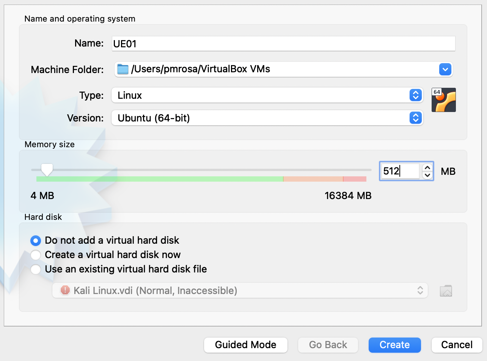
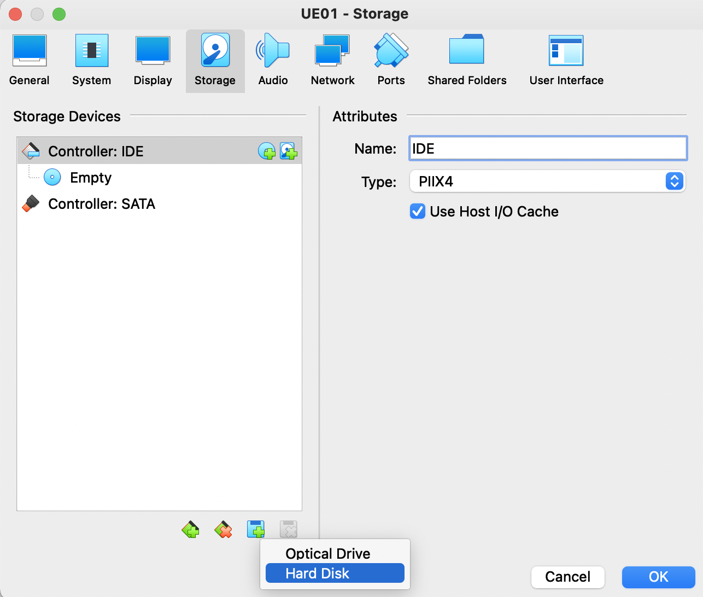
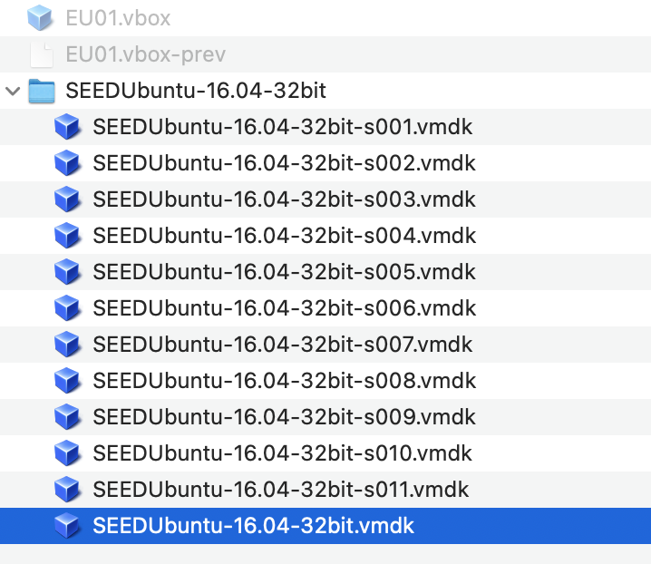
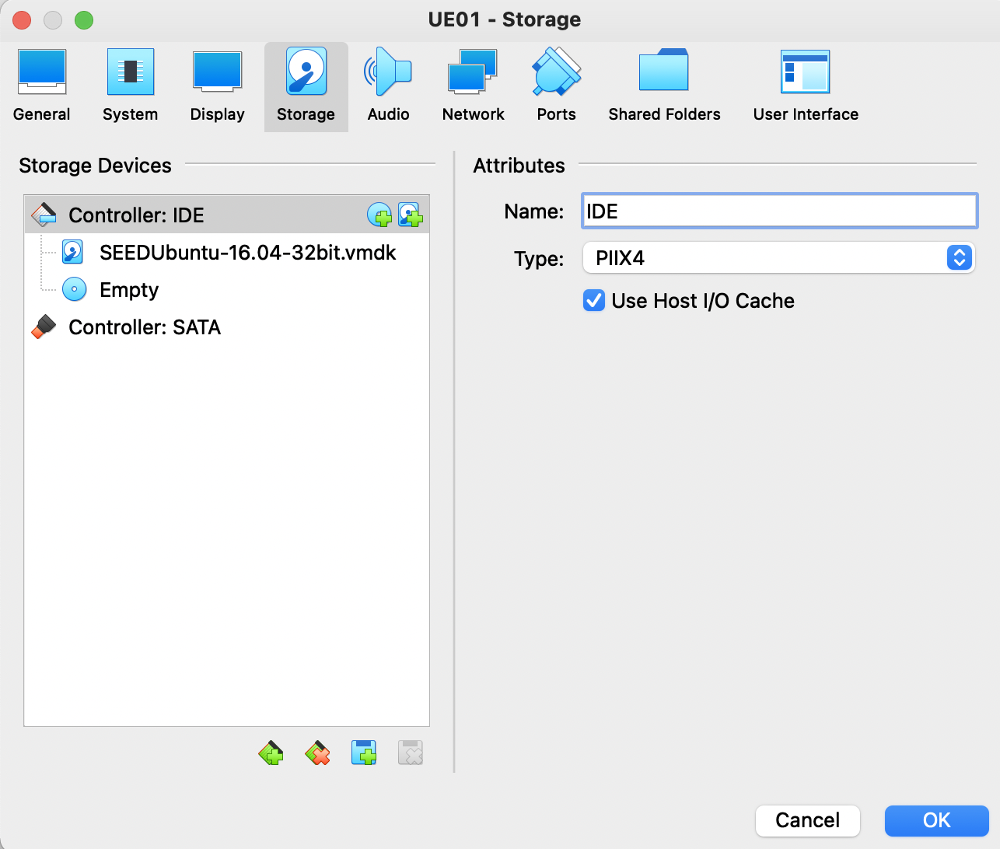

# Aulas de Laboratórios Práticos


1. Laboratório 1: Cisco Packet Tracer I 
2. Laboratório 2: Cisco Packet Tracer II
3. Laboratório 3: Routing I (com máquinas virtuais) 
5. Laboratório 4: Routing II/Firewall (com máquinas virtuais)
6. Laboratório 5: Captura de Tráfego numa Rede (com máquinas virtuais)
7. Laboratório 6: Cisco Packet Tracer III

## 0. Preparação dos Laboratórios / Pré-Requisitos

### 0.1 Instalação do Cisco Packet Tracer (Labs 1,2 e 6)

***Pré-requisito: Ter uma conta na [Cisco NetAcad](https://www.netacad.com)***

Para criar conta: Escolher Login, introduzir o endereço de mail e prosseguir. Quando for detetado que o mail não está registado aparece uma opção `Create New Account`. Esta conta será a mesma que deve ser utilizada no inicio do programa, depois de instalado.
Após criação da conta pode efetuar o download [aqui](https://www.netacad.com/portal/resources/packet-tracer)

***Em alternativa fazer nos seguintes links o download: [Windows 64bits](https://filesender.fccn.pt/?s=download&token=a5e24604-34f4-40e7-8540-5791b298e66f) | [Mac OS 64bit](https://filesender.fccn.pt/?s=download&token=17671cd2-f472-48c6-8dff-37a0c964869c).*** Necessita na mesma de uma conta na NetAcad da Cisco. Link disponivel até 25 de março.

Em Fev/2022 os requisitos e versões disponiveis eram as seguintes:

```
To successfully install and run Cisco Packet Tracer 8.1, the following system requirements must be met:

Cisco Packet Tracer 8.1 (64 bit):
Computer with one of the following operating systems: Microsoft Windows 8.1, 10, 11 (64bit), Ubuntu 20.04 LTS (64bit) or macOS 10.14 or newer.
amd64(x86-64) CPU
4GB of free RAM
1.4 GB of free disk space

 
Cisco Packet Tracer 8.1 (32 bit):    
Computer with one of the following operating systems: Microsoft Windows 8.1, 10, 11 (32bit)
x86 compatible CPU
2GB of free RAM
1.4 GB of free disk space
```

Existem versões para os seguintes sistemas operativos:
```
Windows Desktop Version 8.1.1 English
64 Bit Download
32 Bit Download
 
Ubuntu Desktop Version 8.1.1 English
64 Bit Download

macOS Version 8.1.1 English
64 bit Download
``` 

### 0.2 Instalação de Máquinas Virtuais em equipamentos dos alunos (Labs 3,4 e 5)

***Pré-requisito: VirtualBox instalado em Windows, MacOS, Linux.***

Para as aulas práticas iremos utilizar os materiais do ***[SEED Labs Project](https://seedsecuritylabs.org/)***, mais precisamente a máquina virtual ***SEEDUbuntu16.04***.
Esta [página](https://seedsecuritylabs.org/labsetup.html) na secçãoo Ubuntu 16.04 estão vários links para download (pode fazer a partir [daqui](https://drive.google.com/file/d/12l8OO3PXHjUsf9vfjkAf7-I6bsixvMUa/view?usp=sharing)) da imagem e do [manual de instalação](https://seedsecuritylabs.org/Labs_16.04/Documents/SEEDVM_VirtualBoxManual.pdf) para o VirtualBox.

Instruções resumidas (podem não dispensar a consulta do manual referido anteriormente):

1. Efetuar o download da imagem da máquina virtual em Linux/Ubuntu 16.04
2. Criar uma Máquina Linux no VirtualBox com o nome que pretender, sugere-se UE01. Irá necessitará de criar várias máquinas.

Após escolher a opção criar máquina virtual deve 1) dar nome à VM, 2) escolher o sistema operativo (para o caso da máquina SEEDUbuntu-16-04-32bit poderá escolher 32bits), 3) diminuir a memória para 512 MB e 4) escolher a opção de **não** adicionar nenhum disco virtual (adicionará seguidamente o ficheiro que fez download).



3. Descomprimir o ficheiro .zip que fez download para o mesmo diretorio da máquina virtual e adicionar o disco à VM UE01.

4. Após criar a máquina deverá entrar nos *settings* da máquina, entrar na *tab* *Storage* e escolher a opção de adicionar um disco.



Deve escolher o ficheiro principal do disco da máquina.



Após adicionar, o disco deverá aparecer nas configuração de *Storage* da máquina virtual.



5. Poderá ter de escolher a placa gráfica VBoxVGA (por forma a poder alterar a resolução da placa gráfica)
6. Iniciar a máquina virtual (credenciais - user:seed; password:dees)
7. Atualizar o sistema operativo: `sudo apt update; sudo apt upgrade`
8. Atualizar o teclado para português:
  - Apenas na sessão: `setxkbmap pt`
  - Alteração permanente: `sudo dpkg-reconfigure keyboard-configuration` - aceitar o primeiro parametro que aparece por omissão (tipo de teclado); escolher na segunda questão o teclado português; escolher as outras opções todas por omissão até ao final.
10. Após arrancar com a máquina, a componente de gestão de rede poderá retirar/alterar as configurações que irá efetuar nos laboratórios. Para evitar que isso aconteça deve desligar o automatismo: 1) após arrancar com a máquina, ir a *System Settings* (barra lateral, roda dentada); 2) Entrar em *Network*; 3) Escolher *Wired* e *Options*; 4) Escolher *General* e retirar o visto de *Automatically connect to this network when it is available*; 5) Escolher *IPv4 Settings* e alterar o *Method* para *Disabled*. Se efetuar esta operação após clonar as máquinas, deverá efetuar isso em todas as máquinas mas na **UE01** não o deve fazer no terceiro interface (o que está ligado à Internet).
11. Caso haja algum problema de incompatibilidade no arranque da máquina, por favor verifique que tem a *VT Technology* (VT-x) ativa na bios do seu computador. Normalmente essa opção encontra-se facilmente mas, por favor, consulte a documentação do fabricante caso seja necessário.

*Nota: É possível correr as máquinas dos SEED LABS na Cloud. [Neste repositório](https://github.com/seed-labs/seed-labs/blob/master/manuals/cloud/seedvm-cloud.md) da SEED Labs poderá verificar como o fazer. Não haverá suporte do Docente para esta configuração*

Informações uteis:
- Para editar ficheiros de texto pode usar o `vi` dentro do *terminal* ou o `gedit` em modo gráfico (mais simpático e prático) - também pode invocar o `gedit` dentro de um terminal escrevendo o nome do comando.
- Para desligar as máquinas pode fazer `shutdown -h now`; restart `shutdown -r now`

# Laboratórios
Para a calendarização prevista dos seguintes laboratórios ver as [aqui](https://github.com/pmrosa-classes/ComputerNetworksEI/blob/main/README.md#planeamento-previsto-pode-sofrer-alteraçõesplaneamento) as datas.

## 1. Laboratório 1: Cisco Packet Tracer I 

- Apresentação do interface da ferramenta Cisco Packet Tracer
- Primeiras configurações do [Roteiro do Packet Tracer para as aulas Práticas](https://github.com/pmrosa-classes/ComputerNetworksEI/blob/main/AulasLabsPraticos/roteiro-packet-tracer.md)

## 2. Laboratório 2: Cisco Packet Tracer II 

Continuação das configurações do [Roteiro do Packet Tracer para as aulas Práticas](https://github.com/pmrosa-classes/ComputerNetworksEI/blob/main/AulasLabsPraticos/roteiro-packet-tracer.md)

## 3. Laboratório 3: Routing I 

Seguir os [seguintes](https://github.com/pmrosa-classes/ComputerNetworksEI/blob/main/AulasLabsPraticos/RoutingI.md) passos para a realização do laboratório.

## 4. Laboratório 4: Routing II

Seguir os [seguintes](https://github.com/pmrosa-classes/ComputerNetworksEI/blob/main/AulasLabsPraticos/RoutingII.md) passos para a realização do laboratório.

## 5. Laboratório 5: Captura de Tráfego numa Rede 

Seguir os [seguintes](https://github.com/pmrosa-classes/ComputerNetworksEI/blob/main/AulasLabsPraticos/CapturaTrafegoRede.md) passos para a realização do laboratório.

## 6. Laboratório 6: Cisco Packet Tracer III

- Utilização de dispositivos IoT na ferramenta Cisco Packet Tracer
- Configurações básicas de Servidor de IoT e equipamentos exemplo segundo o Roteiro do Packet Tracer para IoT
- Disponível brevemente

