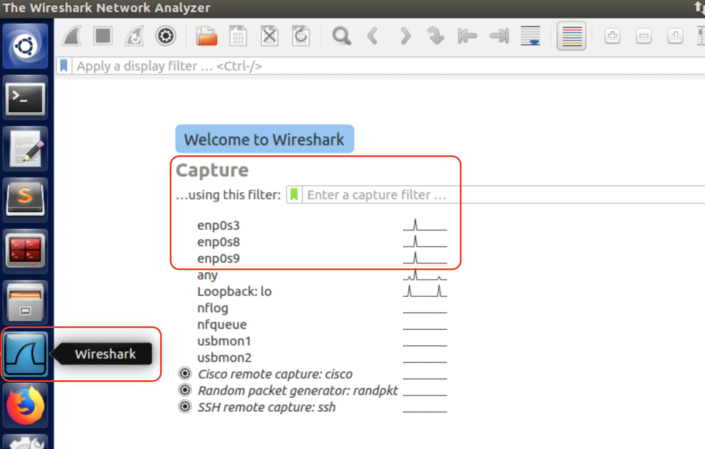
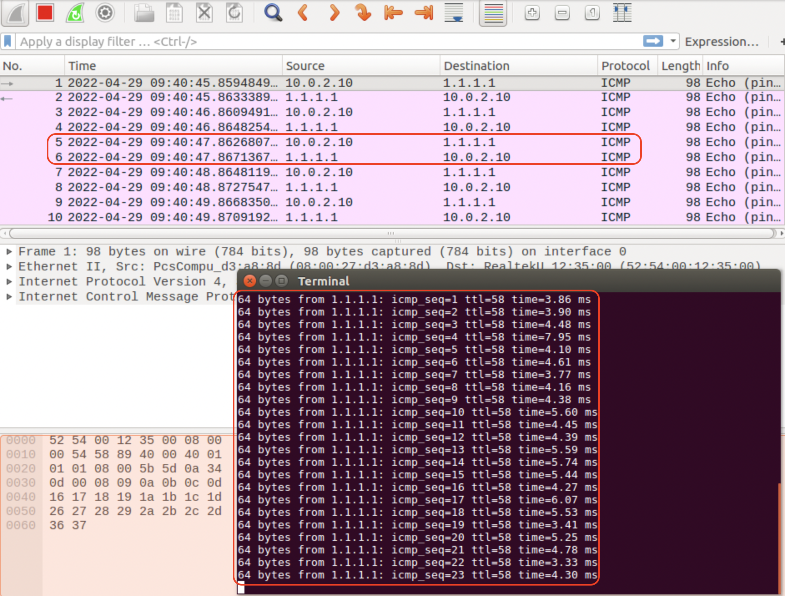
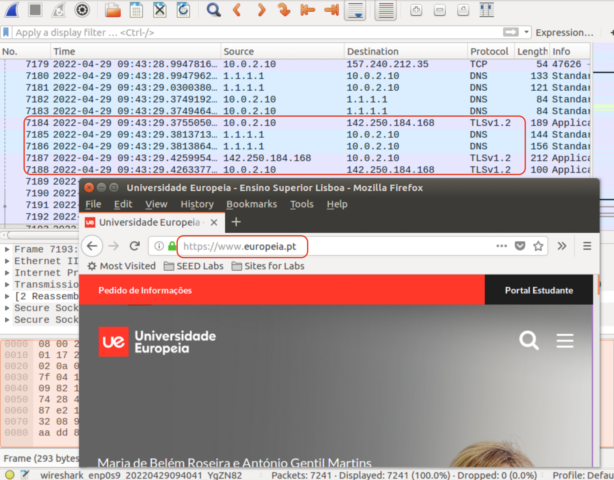

# Laboratório 5: Captura de Tráfego

O Laboratório 5 tem como objetivo **aprofundar os conhecimentos obtidos no laboratório anterior na área de Captura de Tráfego numa rede** através de configurações em máquinas virtuais Linux (Ubuntu).

***Pré-requisito: Três máquinas virtuais - Instalação de pelo menos uma máquina virtual do SEED Project e dois clones; ter o Laboratório 3 - Routing I efetuado; ter o Laboratório 4 - Routing II/Firewall efetuado;***

## 0. Notas Prévias

Todos os interfaces das máquinas virtuais devem ter sido configurados como indicado nas notas prévias dos Labs, ou seja, em modo promiscuo com *Allow All*.

O *tcpdump* é um comando utilizado num terminal em Linux para capturar tráfego.

O *wireshark* é uma ferramenta semelhante mas em modo gráfico, com um interface mais simpático e prático.

## 1. *tcpdump* 

### 1.1 Testar *tcpdump*

Tal como já indicado no anterior laboratório, a utilização do *tcpdump* poderá ser efetuada apenas com recurso à indicação do interface de rede a capturar:

Em **UE01**:

`$ sudo tcpdump -i enp0s3`

`$ sudo tcpdump -i enp0s8`

`$ sudo tcpdump -i enp0s9`

Em **UE02**:

`$ sudo tcpdump -i enp0s3`

Em **UE03**:

`$ sudo tcpdump -i enp0s3`

Em qualquer máquina para capturar **todos os interfaces**:

`$ sudo tcpdump -i any`

Poderá ser util incluir outras opções. A titulo de exemplo vejam-se as seguintes possibilidades (deverá abrir duas janelas de *terminal* para fazer os testes: uma para correr o *tcpdump* e outra para fazer os comandos indicados ou que deseja testar):

#### 1.1.1 Especificar endereços de origem ou destino

`$ sudo tcpdump -i enp0s3 src host <IP de origem>`

`$ sudo tcpdump -i enp0s3 dst host <IP de destino>`

Pode, por exemplo, no **UE01** colocar um *ping* a fazer para a internet e capturar esse tráfego desse endereço especifico:

`$ sudo tcpdump -i any dst host 1.1.1.1`

Exprimente efetuar um ping a este endereço noutra janela. Deverão aparecer os pacotes ICMP. Agora exprimente efetuar um *ping* para o **UE03**, isto é, **192.168.2.2**. Esses pacotes não deverão aparecer!

Na verdade nem precisariamos de incluir *-i any* mas apenas *-i enp0s9* que é o interface para o exterior, no entanto aí não iriam aparecer certamente os pacotes de teste para o **192.168.2.2**.


#### 1.1.2 Especificar endereços de origem e destino 

Também é possível filtrar pacotes entre uma origem e um destino especifico.

`$ sudo tcpdump -i enp0s3 src host 192.168.1.1 dst host 192.168.1.2`


#### 1.1.3 Especificar detalhes das ligações capturadas 

Os dois parametros seguintes permitem dar mais detalhes sobre as informações capturadas. Poderá, por exemplo, em qualquer um dos servidores capturar o tráfego no primeiro interface:

`$ sudo tcpdump -i enp0s3 –X -XX`

Testando um `ping` desde **UE02** para a **UE01**, primeiro sem detalhes:

```
$ sudo tcpdump -i enp0s3 
tcpdump: verbose output suppressed, use -v or -vv for full protocol decode
listening on enp0s3, link-type EN10MB (Ethernet), capture size 262144 bytes
07:38:05.657284 IP 192.168.1.2 > 192.168.1.1: ICMP echo request, id 4956, seq 1, length 64
07:38:05.657332 IP 192.168.1.1 > 192.168.1.2: ICMP echo reply, id 4956, seq 1, length 64
07:38:06.682057 IP 192.168.1.2 > 192.168.1.1: ICMP echo request, id 4956, seq 2, length 64
07:38:06.682101 IP 192.168.1.1 > 192.168.1.2: ICMP echo reply, id 4956, seq 2, length 64
07:38:07.705988 IP 192.168.1.2 > 192.168.1.1: ICMP echo request, id 4956, seq 3, length 64
07:38:07.706033 IP 192.168.1.1 > 192.168.1.2: ICMP echo reply, id 4956, seq 3, length 64
```

Depois fazendo o mesmo teste mas executando o comando com os parametros adequados para mostrar mais detalhes:

```
$ sudo tcpdump -i enp0s3 -X -XX
tcpdump: verbose output suppressed, use -v or -vv for full protocol decode
listening on enp0s3, link-type EN10MB (Ethernet), capture size 262144 bytes
07:38:13.349432 IP 192.168.1.2 > 192.168.1.1: ICMP echo request, id 4958, seq 1, length 64
	0x0000:  0800 2728 4774 0800 2757 e47b 0800 4500  ..'(Gt..'W.{..E.
	0x0010:  0054 3fee 4000 4001 7767 c0a8 0102 c0a8  .T?.@.@.wg......
	0x0020:  0101 0800 e87a 135e 0001 256f 3462 b251  .....z.^..%o4b.Q
	0x0030:  0500 0809 0a0b 0c0d 0e0f 1011 1213 1415  ................
	0x0040:  1617 1819 1a1b 1c1d 1e1f 2021 2223 2425  ...........!"#$%
	0x0050:  2627 2829 2a2b 2c2d 2e2f 3031 3233 3435  &'()*+,-./012345
	0x0060:  3637                                     67
07:38:13.349537 IP 192.168.1.1 > 192.168.1.2: ICMP echo reply, id 4958, seq 1, length 64
	0x0000:  0800 2757 e47b 0800 2728 4774 0800 4500  ..'W.{..'(Gt..E.
	0x0010:  0054 508a 0000 4001 a6cb c0a8 0101 c0a8  .TP...@.........
	0x0020:  0102 0000 f07a 135e 0001 256f 3462 b251  .....z.^..%o4b.Q
	0x0030:  0500 0809 0a0b 0c0d 0e0f 1011 1213 1415  ................
	0x0040:  1617 1819 1a1b 1c1d 1e1f 2021 2223 2425  ...........!"#$%
	0x0050:  2627 2829 2a2b 2c2d 2e2f 3031 3233 3435  &'()*+,-./012345
	0x0060:  3637                                     67
07:38:14.351287 IP 192.168.1.2 > 192.168.1.1: ICMP echo request, id 4958, seq 2, length 64
	0x0000:  0800 2728 4774 0800 2757 e47b 0800 4500  ..'(Gt..'W.{..E.
	0x0010:  0054 4023 4000 4001 7732 c0a8 0102 c0a8  .T@#@.@.w2......
	0x0020:  0101 0800 df71 135e 0002 266f 3462 ba59  .....q.^..&o4b.Y
	0x0030:  0500 0809 0a0b 0c0d 0e0f 1011 1213 1415  ................
	0x0040:  1617 1819 1a1b 1c1d 1e1f 2021 2223 2425  ...........!"#$%
	0x0050:  2627 2829 2a2b 2c2d 2e2f 3031 3233 3435  &'()*+,-./012345
	0x0060:  3637                                     67
07:38:14.351396 IP 192.168.1.1 > 192.168.1.2: ICMP echo reply, id 4958, seq 2, length 64
	0x0000:  0800 2757 e47b 0800 2728 4774 0800 4500  ..'W.{..'(Gt..E.
	0x0010:  0054 50cf 0000 4001 a686 c0a8 0101 c0a8  .TP...@.........
	0x0020:  0102 0000 e771 135e 0002 266f 3462 ba59  .....q.^..&o4b.Y
	0x0030:  0500 0809 0a0b 0c0d 0e0f 1011 1213 1415  ................
	0x0040:  1617 1819 1a1b 1c1d 1e1f 2021 2223 2425  ...........!"#$%
	0x0050:  2627 2829 2a2b 2c2d 2e2f 3031 3233 3435  &'()*+,-./012345
	0x0060:  3637                                     67
07:38:15.353837 IP 192.168.1.2 > 192.168.1.1: ICMP echo request, id 4958, seq 3, length 64
	0x0000:  0800 2728 4774 0800 2757 e47b 0800 4500  ..'(Gt..'W.{..E.
	0x0010:  0054 409e 4000 4001 76b7 c0a8 0102 c0a8  .T@.@.@.v.......
	0x0020:  0101 0800 3366 135e 0003 276f 3462 6564  ....3f.^..'o4bed
	0x0030:  0500 0809 0a0b 0c0d 0e0f 1011 1213 1415  ................
	0x0040:  1617 1819 1a1b 1c1d 1e1f 2021 2223 2425  ...........!"#$%
	0x0050:  2627 2829 2a2b 2c2d 2e2f 3031 3233 3435  &'()*+,-./012345
	0x0060:  3637                                     67
07:38:15.353875 IP 192.168.1.1 > 192.168.1.2: ICMP echo reply, id 4958, seq 3, length 64
	0x0000:  0800 2757 e47b 0800 2728 4774 0800 4500  ..'W.{..'(Gt..E.
	0x0010:  0054 51af 0000 4001 a5a6 c0a8 0101 c0a8  .TQ...@.........
	0x0020:  0102 0000 3b66 135e 0003 276f 3462 6564  ....;f.^..'o4bed
	0x0030:  0500 0809 0a0b 0c0d 0e0f 1011 1213 1415  ................
	0x0040:  1617 1819 1a1b 1c1d 1e1f 2021 2223 2425  ...........!"#$%
	0x0050:  2627 2829 2a2b 2c2d 2e2f 3031 3233 3435  &'()*+,-./012345
	0x0060:  3637                                     67
```

No caso de um `ping` os dados que podemos ver não são especialmente interessantes mas no caso de termos ligações onde sejam enviados dados entre ambas as máquinas, poderemos ver os dados (inputs e outputs) que passam no canal de comunicação.


---

#### 1.1.4 Listar conteudos de pacotes em ASCII (texto) 

`$ sudo tcpdump -A -i enp0s3`

---

#### 1.1.5 Listar conteudos de pacotes em Hexadecimal 

`$ sudo tcpdump -XX -i enp0s3`

---

#### 1.1.6 Capturar pacotes sem resolver endereços de DNS (mostra endereços IP)

`$ sudo tcpdump -n -i enp0s3`

---

#### 1.1.6 Capturar pacotes com timestamps comuns

`$ sudo tcpdump -n -tttt -i enp0s3`

---

#### 1.1.7 Capturar pacotes numa determinada porta (neste caso ssh)

`$ sudo tcpdump -i enp0s3 port 22`

Para testar poderá abrir uma sessão *ssh* com outro host, como efetuado anteriromente.

---

#### 1.1.8 Capturar pacotes com destino num host e numa porta (neste caso ssh) e escrever o resultado num ficheiro

`$ sudo tcpdump -w comm.pcap -i enp0s3 dst 16.181.170.246 and port 22`

Para testar poderá abrir uma sessão *ssh* com outro host, como efetuado anteriromente.

---

#### 1.1.9 Capturar pacotes entre dois hosts especificos e escrever o resultado num ficheiro

`$ sudo tcpdump -w output.pcap -i enp0s3 src 192.168.1.1 and port 22 and dst 192.168.1.2 and port 22`

---

#### 1.1.10 Capturar pacotes excepto *arp* e *rarp*

`$ sudo tcpdump -i enp0s3 not arp and not rarp`

---

### 1.1.11 Capturar pacotes *arp*

`$ sudo tcpdump -i enp0s3 arp`


## 2. *Wireshark*

Adicionalmente poderá utilizar a ferramenta *Wireshark* para capturar tráfego num determinado *host*.

A ferramenta encontra-se instalada nas máquinas virtuais do SEED Project, como indicado na seguinte imagem. Para iniciar a captura basta escolher o interface desejado e iniciar a captura no botão superior de uma *barbatana*.



Coloque um *ping* de um *host* para outro, sendo um deles a própria máquina onde está a correr o *wireshark* e não corra mais nenhuma outra aplicação de rede. No *wireshark* poderá ver os pacotes de *ICMP* de uma forma visual e com identificação colorida. 



Após isso tente, com o *browser Firefox* disponível nas máquinas, aceder à página da Universidade Europeia. No *wireshark* poderá ver os pacotes desse acesso. Se carregar em cima de um desses pacotes e escolher a opção *Follow Stream* poderá ver o conjunto de pacotes dessa ligação (em qualquer protocolo TCP).



No campo de pesquisa/filtro da ferramenta poderá tentar repetir alguns dos exercicios do ponto 1. (*tcpdump*) com o *wireshark*. 

