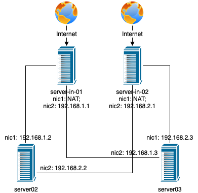

# Trabalho Routing 1

*O presente trabalho deve ser realizado após a aula prática com o exercicio RoutingI efetuado nas máquinas virtuais*

## Entregáveis
Entregue um **documento em PDF** com o **nome Gxx-RoutingI.pdf** 

## Identificação

A **primeira página** do documento deve ter as seguintes informções, no seguinte formato:

>**Trabalho Prático - Lab Routing I**
>
>**Turma X**
>
>Elementos do Grupo:
>- NumAluno - Primeiro Ultimo Nome
>- NumAluno - Primeiro Ultimo Nome
>- NumAluno - Primeiro Ultimo Nome

## Perguntas

Inicie a resposta às questões na **segunda página**. Identifique claramente as questões através do número da questão.

Considere o seguinte diagrama de rede:

Para todas as questões utilize sempre os nomes dos servidores indicados no diagrama e respetivos identificadores das placas de rede (nicX). No caso de desejar usar os identificadores dos interfaces de rede que as máquinas virtuais do projeto SEED utilizam, faça uma relação entre o que é os nicX e o novo nome que utiliza.

1. Atendendo ao diagrama rede que configurações a nível de placas de rede seriam necessárias no VirtualBox?
2. Quais os comandos necessários para configurar, os endereços de todos os interfaces de rede em todas as máquinas?
3. Existem dois servidores ligados à internet. Deve ter isso em atenção ao configurar as rotas por omissão nos outros servidores. Indique os comandos necessários a efetuar e em que servidores.
4. Indique os comandos necessários, nos servidores que entender, para efetuar o NAT, isto é, possibilitar que todos consigam aceder à Internet.
