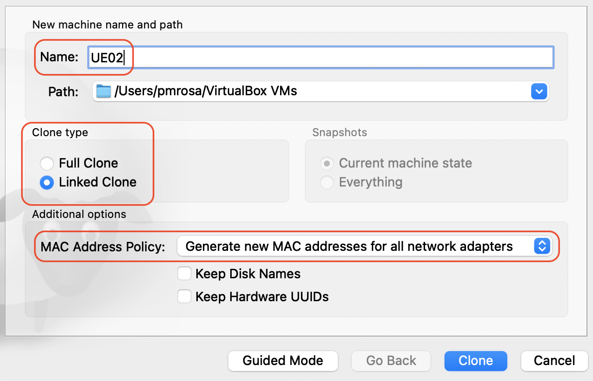
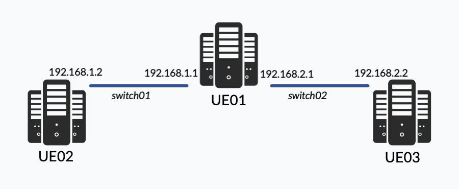
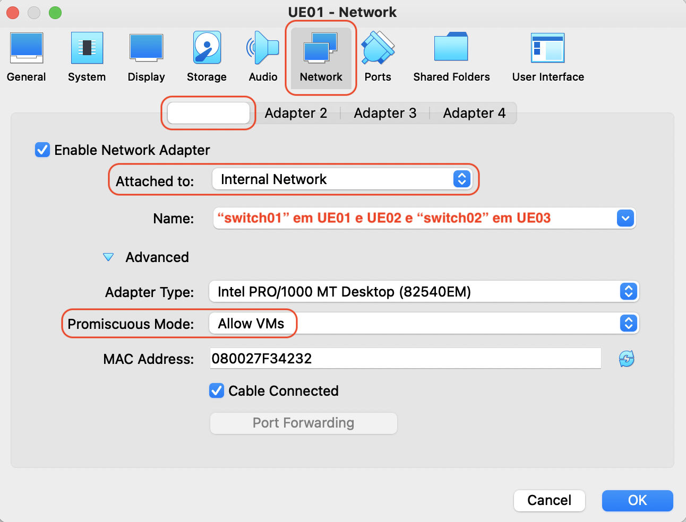
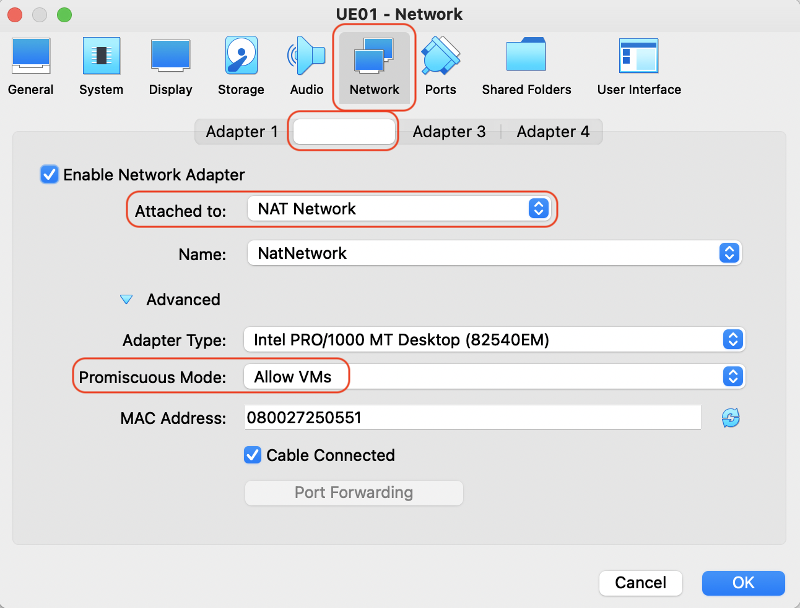
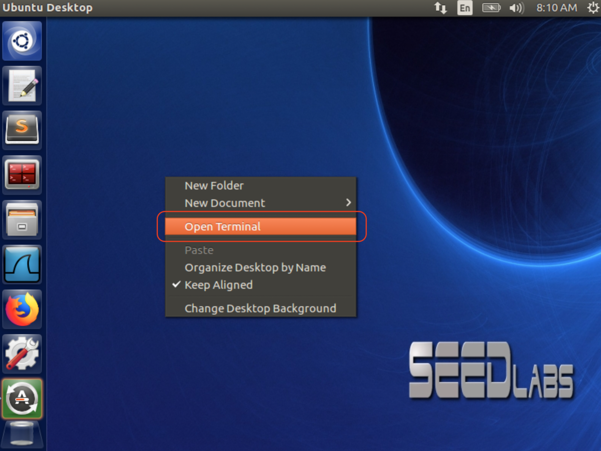
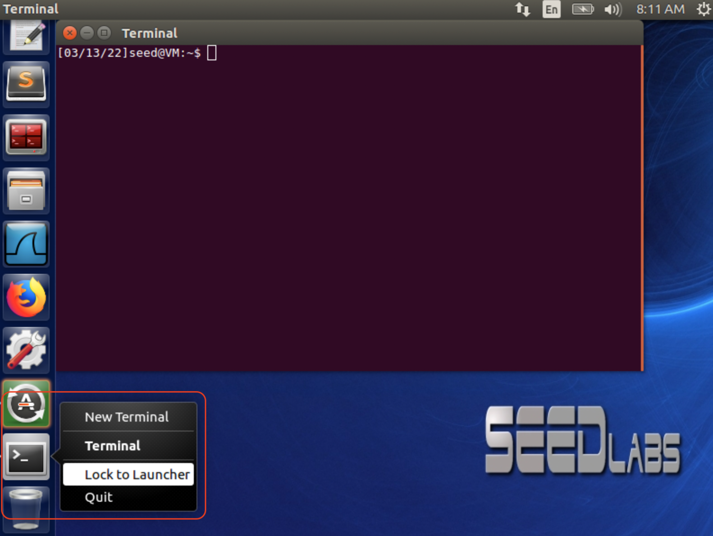

# Laboratório 1: Routing I

O Laboratório 2 tem como objetivo **Introduzir sistema de endereçamento e routing de pacotes IP** através de configurações em máquinas virtuais Linux (Ubuntu).

***Pré-requisito: Três máquinas virtuais - Instalação de pelo menos uma máquina virtual do SEED Project e dois clones.***

Relembra-se o uso de nomes como **UE01**, **UE02** e **UE03**, ou algo do género, para as máquinas virtuais. Na documentação serão usados esses identificadores.

Os clones deverão ser realizados no VirtualBox e **sempre a partir da máquina original UE01**. Para tal deverá escolher a opção `Clone` nessa VM, nomear a máquina virtual (UE02 primeiro e UE03 na máquina seguinte) e escolher a opção `MAC Adress Policy: Generate new MAC addresses for all network adapters`. No final escolher `Linked Clone` para poupar espaço de armazenamento. O outro tipo de clone duplica o espaço em disco gasto pela primeira máquina virtual; o Linked Clone apenas grava as diferenças em relação à máquina original.



Os recursos necessários para as máquinas virtuais não necessitam de ser superiores a 1 processador / 512Mb RAM. No caso dos clones isso será mantido, de acordo com a máquina original.

## 0. Topologia a implementar




Nos Settings da VirtualBox deve adicionar duas placas de rede em **UE01** e uma placa de rede em **UE02** e **UE03**.
A primeira placa de rede de todas as máquinas deverá ser do tipo `Internal Network`; a segunda placa de rede do **UE01** deve ser do tipo `NAT Network`.

Ainda no mesmo local dos Settings, as primeiras placas de rede da **UE01** e **UE02** devem ser ligadas a um switch `switch01` (campo *Name*); a segunda placa de rede do **UE01** e a primeira placa de rede da **UE03** estão ligadas ao `switch02`.

Escolher a opção `Promiscuous Mode: Allow VMs` em *Advanced*. 

Ver exemplos seguintes:

Primeira placa (idêntico para UE01, UE02 e UE03):



Segunda Placa (UE01):



De notar que, em principio, os nomes das placas de rede nas máquinas virtuais deverao ser:
- Primeira placa de rede: `enp0s3`
- Segunda placa de rede: `enp0s8`
- Terceira placa de rede: `enp0s9`

## 1. Interligar Máquinas Virtuais

Na grande maioria das configurações a efetuar nos laboratórios irá utilizar uma janela de terminal. Se desejar poderá adicionar um *shortcut* ao *launcher* lateral:

Deve clicar no botão direito do rato no *desktop* e escolher a opção *Open Terminal*



Após o *Terminal* abrir, deverá clicar no botão direito do rato em cima do icon do *Terminal* e escolher a opção *Lock to Launcher*. 



Após isso poderá arrastar o icon mais para cima ficando a carregar no botão esquerdo do rato e arrastando.


## 1.1 Interligar UE01 com UE02

Para interligar estas duas máquinas virtuais, deve configurar os seguintes endereços em cada uma delas:

**UE01** - interface `enp0s3` - **192.168.1.1**

`$ sudo ifconfig enp0s3 192.168.1.1/24 up`

**UE02** - interface `enp0s3` - **192.168.1.2**

`$ sudo ifconfig enp0s3 192.168.1.2/24 up`

Para garantir que os novos endereços ficam ativos poderá reiniciar a componente de networking:

`$ sudo /etc/init.d/networking force-reload`

Deverá depois certificar-se que tudo está correto através dos seguintes comandos:

```
$ /sbin/ifconfig
$ /sbin/route
```

Para verificar se tem conectividade poderá utilizar o `ping`:

(a partir da UE01) `$ ping 192.168.1.2`

(a partir da UE02) `$ ping 192.168.1.1`

Deverá ter um output semelhante a este:
```
seed@VM:~$ ping 192.168.1.2
PING 192.168.1.2 (192.168.1.2) 56(84) bytes of data.
64 bytes from 192.168.1.2: icmp_seq=1 ttl=57 time=30.8 ms
64 bytes from 192.168.1.2: icmp_seq=2 ttl=57 time=23.8 ms
64 bytes from 192.168.1.2: icmp_seq=3 ttl=57 time=24.7 ms

```

## 1.2 Interligar UE01 com UE03

Para interligar estas duas máquinas virtuais, deve configurar os seguintes endereços em cada uma delas:

**UE01** - interface `enp0s8` - **192.168.2.1**

`$ sudo ifconfig enp0s3 192.168.1.1/24 up`

**UE03** - interface `enp0s3` - **192.168.2.2**

`$ sudo ifconfig enp0s3 192.168.1.2/24 up`

Para garantir que os novos endereços ficam ativos poderá reiniciar a componente de networking:

`$ sudo /etc/init.d/networking force-reload`

Deverá depois certificar-se que tudo está correto através dos seguintes comandos:

```
$ /sbin/ifconfig
$ /sbin/route
```

Para verificar se tem conectividade poderá utilizar o `ping`:

(a partir da UE01) `$ ping 192.168.2.2`

(a partir da UE03) `$ ping 192.168.2.1`

## 1.3 Interligar UE01 com a Internet

Para poder ter internet nesta máquina terá de desligar a máquina com `$ sudo shutdown -h now` e adicionar uma terceira placa de rede. O switch a que se deverá ligar deverá estar configurado como *Natted*. Quando arrancar com a máquina deverá ter um terceiro interface de rede `enp0s9` que obteve automaticamente um endereço para aceder à Internet.
Para verificar isso deve:
```
$ /sbin/ifconfig
```

Poderá testar o acesso à Internet através de um `ping`
```
$ ping 1.1.1.1
``` 
*Nota: O endereço 1.1.1.1 é um servidor público da Cloudfare. Pode tambem testar para um endereço semelhante da Google 8.8.8.8 ou outro qualquer desde que não utilize nomes, uma vez que ainda não foi configurado nenhum servidor de DNS.*

## 1.4 Preparar a UE01 para fazer routing de pacotes e configurar o default gateway da UE02 e UE03

### Configurar UE01

Para conseguir enviar pacotes para redes IPs distintas das que os interfaces estão ligados diretamente, necessita de um endereço de gateway (normalmente o *default gateway*). No nosso caso esse gateway será a máquina **UE01** que já está ligada à internet. Para tal será necessário ligar o *forwarding* de pacotes nessa máquina.

Pode verificar que o *forwarding* de pacotes está **desligado** através do comando seguinte:
```
$ /sbin/sysctl net.ipv4.conf.all.forwarding
```
O resultado deve ser 0.

Para **ativar** o *forwarding* deverá alterar o valor para 1:
```
$ sudo sysctl net.ipv4.ip_forward=1
```

Para confirmar que o valor ficou definido, deve repetir o comando:
```
$ /sbin/sysctl net.ipv4.conf.all.forwarding
```

### Configurar UE02 e UE03

Com a máquina **UE01** configurada para re-encaminhar pacotes IP, falta configurar nas restantes duas máquinas o endereço do default gateway.

#### UE02

Primeiro deverá testar se consegue chegar a outras redes. Para tal, no **UE02** tente pingar o endereço da outra rede do **UE01**, neste caso o 192.168.2.1:
```
$ ping 192.168.2.1
```
Não deverá conseguir. Consegue perceber porquê?

Agora, na mesma máquina **UE02**, deverá colocar o endereço do **UE01** da mesma rede que o **UE02**:
```
$ sudo ip route add default via 192.168.1.1
```
*Nota: Se tiver várias possibilidades de ter rotas default, deve usar metrix X na parte final do comando*

Para verificar se já tem conectividade deverá utilizar o ping:
```
$ ping 192.168.2.1
``` 
Já deverá conseguir. Consegue perceber porquê?

#### UE03

Tal como para a máquina **UE02**, deverá efetuar as mesmas configurações na máquina **UE03**

Primeiro deverá testar se consegue chegar a outras redes. Para tal, na **UE03** tente pingar o endereço da outra rede do **UE01**, neste caso o 192.168.1.1:
```
$ ping 192.168.1.1
```
Não deverá conseguir. Consegue perceber porquê?

Agora, na mesma máquina **UE02**, deverá colocar o endereço do **UE01** da mesma rede que o **UE02**:
```
$ sudo ip route add default via 192.168.2.1
```

Para verificar se já tem conectividade deverá utilizar o ping:
```
$ ping 192.168.1.1
``` 
Já deverá conseguir. Consegue perceber porquê?

### Verificar caminho dos pacotes com o comando *traceroute*

Para verificar os *hops* (saltos/routers) por onde os pacotes passam, poderá utilizar o comando `traceroute`

Para tal, na **UE02** tente chegar ao **UE03** - relembre-se que não está ligado diretamente a essa máquina e que portanto necessita de passar no router, que neste caso é o **UE01** que configurou anteriormente.
```
$ traceroute 192.168.2.2
``` 
Qual o output? Consegue perceber por onde o pacote passou?


## 2. Configurar NAT (Network Address Translation)

A máquina virtual **UE01** já tem Intenet. Pode tentar fazendo um ping para o exterior:
```
$ ping 1.1.1.1
``` 
*Nota: O endereço 1.1.1.1 é um servidor público da Cloudfare. Pode tambem testar para um endereço semelhante da Google 8.8.8.8*

Agora tente fazer o mesmo nas máquinas **UE02** e **UE03**.
Porque razão não conseque?

Na verdade para a Internet não podem ser enviados endereços privados como os da rede 192.168.x.x. Por esse motivo é preciso *transformar* os pacote antes de os enviar para a Internet. Para tal utilizamos NAT - *Network Address Translation* - que transforma os endereços privados internos no endereço público que a máquina **UE01** obteve através do terceiro interface (que está configurado para obter o endereço IP por DHCP e cujo switch foi configurado como NATTED anterirmente).

Para realizar estas configurações, deve:
```
$ sudo iptables -P FORWARD ACCEPT   
$ sudo iptables -F FORWARD           
$ sudo iptables -t nat -F            
$ sudo iptables -t nat -A POSTROUTING  -o enp0s9 -j MASQUERADE   
```

Agora tente efetuar os pings anteriores novamente nas máquinas **UE02** e **UE03**.

```
$ ping 1.1.1.1
``` 
Já deverá conseguir.

## 3. Garantir que as configurações ficam permanentes

Se desligar as máquinas irá perder as configurações. Antes de o fazer edite o ficheiro `/etc/network/interfaces` e coloque as informações anteriromente configuradas (neste caso acrescentou-se um endereço de DNS Server para poder usar nomes de sites posteriromente):

```
# /etc/network/interfaces na UE01

auto lo
iface lo inet loopback

auto enp0s3
iface enp0s3 inet static
    address 192.168.1.11
    netmask 255.255.255.0
    dns-nameservers 1.1.1.1

auto enp0s8
iface enp0s8 inet static
    address 192.168.2.1
    netmask 255.255.255.0
    dns-nameservers 1.1.1.1

auto enp0s9
iface enp0s9 inet dhcp
```

```
# /etc/network/interfaces na UE02

auto lo
iface lo inet loopback

auto enp0s3
iface enp0s3 inet static
    address 192.168.1.2
    netmask 255.255.255.0
    gateway 192.168.1.2
    dns-nameservers 1.1.1.1
```

```
# /etc/network/interfaces na UE03

auto lo
iface lo inet loopback

auto enp0s3
iface enp0s3 inet static
    address 192.168.2.2
    netmask 255.255.255.0
    gateway 192.168.2.1
    dns-nameservers 1.1.1.1
```

Na **UE01** deve edutar ainda o ficheiro `/etc/sysctl.conf`:
```
net.ipv4.ip_forward=1
```

Poderá fazer *Save State* das máquinas virtuais se as desejar ligar novamente nas horas seguintes ou fazer *shutdown* através do comando:
```
$ sudo shutdown -h now
```

*Pedro Rosa - IADE/Universidade Europeia*
