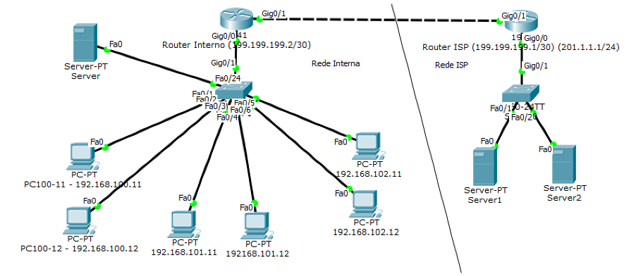
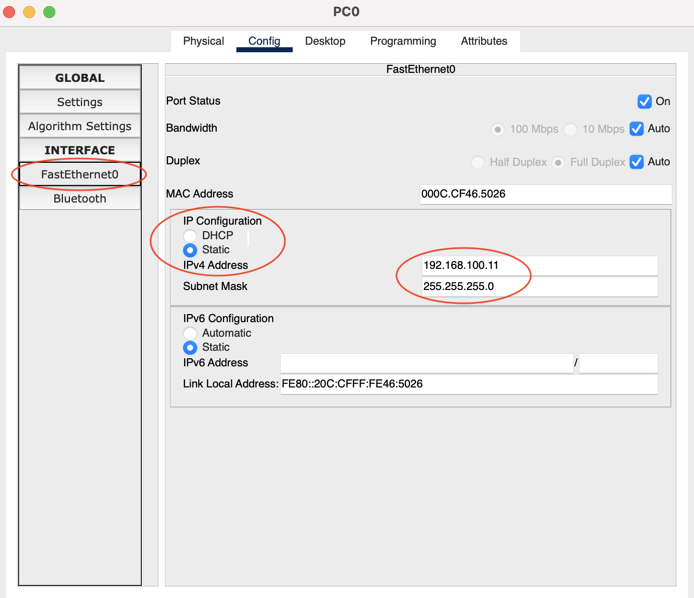
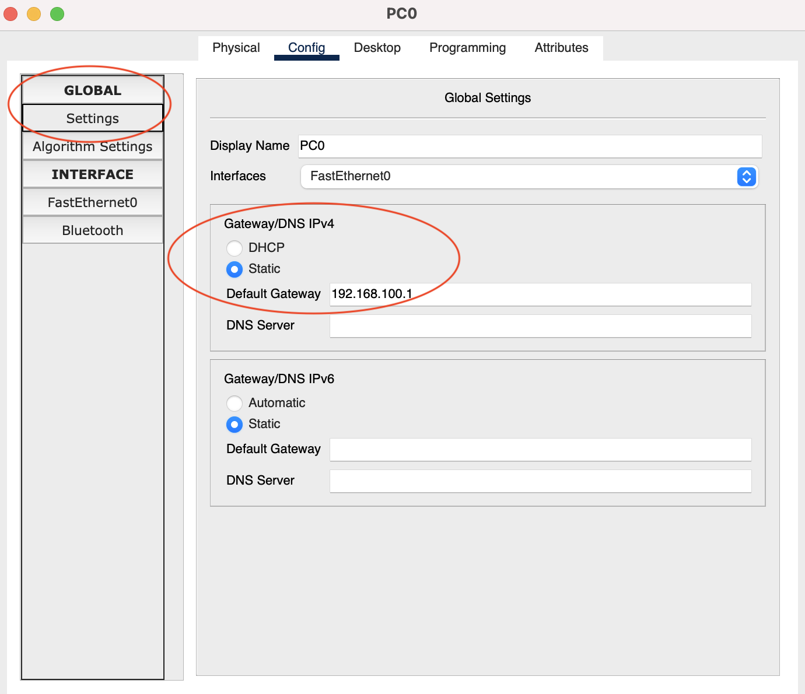
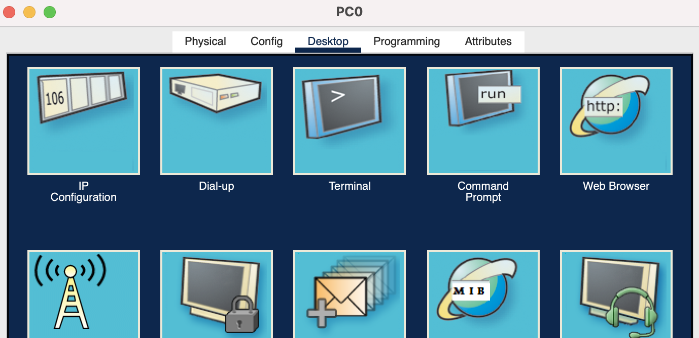
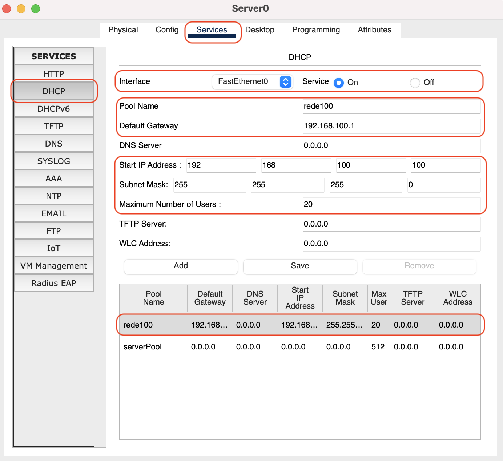
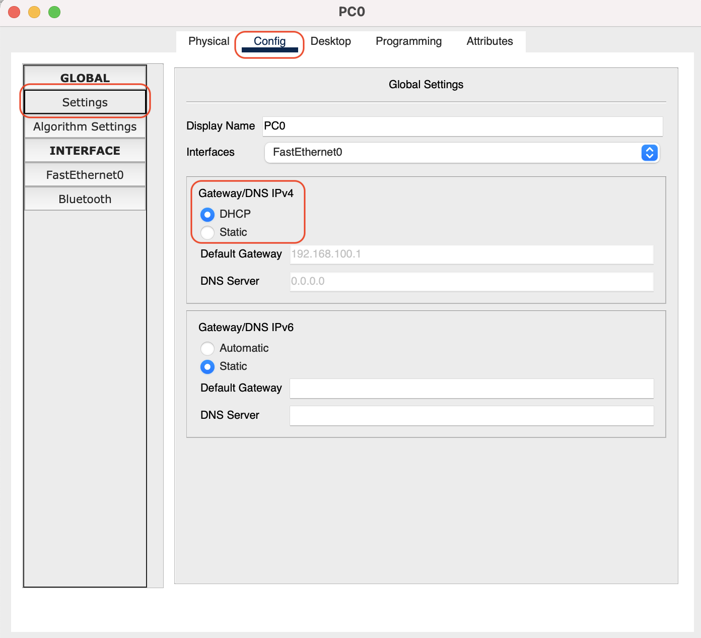
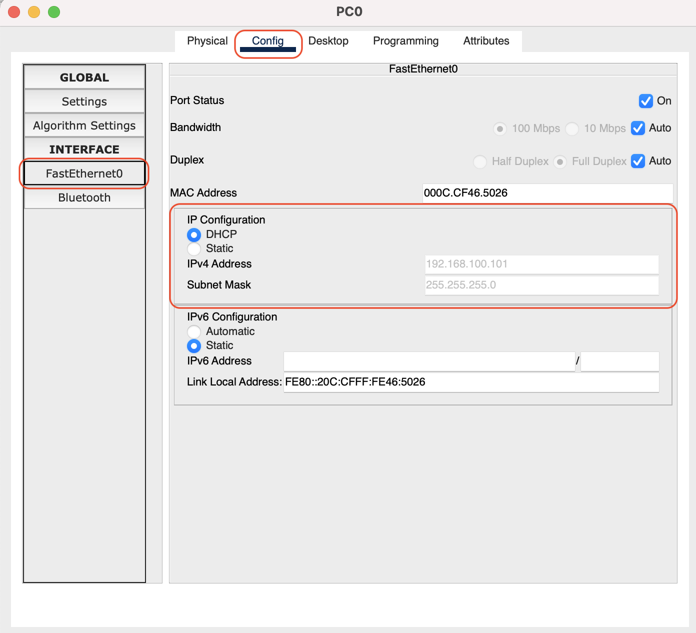

# Aulas Práticas com Cisco Packet Tracer
**VLANs/Routing/NAT/IPv4/DHCPv4/IPv6/DHCPv6**

Diagrama e sintaxe do exercício a realizar durante as aulas práticas com o software Cisco Packet Tracer

*Nota: a forma exata de implementação pode, eventualmente, variar devido a alterações realizadas durante as aulas.*

## Diagrama da Rede a configurar nas Aulas Práticas



## Configurações iniciais / Comandos Uteis

Entrar em modo privilegiado: `enable`

Entrar em modo de configuração: `config terminal`

Atribuir nome ao equipamento: `hostname Router1 `

Atribuir domínio ao equipamento: `ip domain-name universidadeeuropeia.pt`

Password de enable: `enable secret *password*`

Gravação de configurações: `copy running-config startup-config` or `wr`

## Configurar Switching

Após implementar o diagrama deve efetuar as ligações entre os equipamentos nas portas indicadas no diagrama, ou seja, computadores pessoais nas portas *FastEthernet* 1 a 6 (da direita para a esquerda, portanto a comecar pelos computadores da rede **192.168.100.x**). O servidor deve ser ligado às porta 24 (ultima porta *FastEthernet*).

No switch é necessário efetuar as configurações adequadas destas portas. Na aula faz-se esta configuração na gestão gráfica dos equipamentos. Estas são as únicas configurações de equipamentos de rede feitas desta forma (e apenas titulo de exemplo para utilizar a ferramenta de simulação, existe obviamente sintaxe para que possam ser feitas em linha de comando nos equipamentos).

Sendo assim, nas portas onde foram ligados computadores pessoais e o servidor, devem ser colocadas as VLANs adequadas:
- PCs da rede **192.168.100.x** na VLAN 100;
- PCs da rede **192.168.101.x** na VLAN 101;
- PCs da rede **192.168.102.x** na VLAN 102;
- o servidor que está na rede **192.168.200.x** deve ser colocado na VLAN 200. Antes devem-se criar as VLANs no menu adequado. 
Nota: Estas portas são colocadas em *Access* mode no menu de alterar as VLANs. 

Apenas as ligações entre equipamentos deverão ser em configuradas em *Trunk* por passarem várias VLANs. Isso só vai acontecer, tipicamente, na ligação entre routers e switchs ou entre switchs.
Sendo assim, a porta *GigabitEthernet 0/1* no switch (onde se ligou o router) deve ser configurada como *Trunk*.

Acessoriamente, para poder fazer testes nas próximas configurações, poderá desejar configurar os IPs apresentados no diagrama de rede (rede do lado esquerdo) e os endereços de gateway nos PCs e servidor. Para tal deverá abrir as configurações dos PCs e colocar o IP correspondente e a máscara de rede (255.255.255.0) nas configurações do endereço IP no interface de rede (tipicamente *FastEthernet*) e o endereço de gateway no ecrã de *settings*. Colocar sempre em *Manual* o endereço IP e o gatewa, nesta altura.

 

## Configurar IPv4

### Criação dos interfaces dos gateways dos postos de trabalho no router:

```
interface gigabitethernet 0/0.100       *Sub-interface/vlan dentro do interface fisio gi 0/0*
encapsulation dot1Q 100                 *Colocação do interface na vlan 100*
ip address 192.168.100.1 255.255.255.0  *Indicação do ip address deste sub- interface*

interface gigabitethernet 0/0.101
encapsulation dot1Q 101
ip address 192.168.101.1 255.255.255.0

interface gigabitethernet 0/0.102
encapsulation dot1Q 102
ip address 192.168.102.1 255.255.255.0
```

### Criação do gateway do servidores no router:
```
interface gigabitethernet 0/0.200
encapsulation dot1Q 200
ip address 192.168.200.1 255.255.255.0
```
### Ativar administrativamente o interface físico Gigabitethernet 0/0
```
interface gigabitethernet 0
no shutdown	Interfaces nos routers estão em “shutdown” por omissão, por isso têm que ser ativados manualmente
```

### Testar configurações

Se efetuou a configuração manual dos endereços IP anteriromente, já pode testar efetuar um `ping` a partir de um PC a outro PC e ao endereço do *router*.
Para fazer isto deverá usar uma *Command Prompt* (idêntica ao Windows) no menu *Desktop* dentro de um PC ou servidor. 



Após abrir a *Command Prompt* poderá testar a conectividade, por exemplo a partir do PC com o IP 192.168.100.11:
```
C:\>ping 192.168.100.1

Pinging 192.168.100.1 with 32 bytes of data:

Reply from 192.168.100.1: bytes=32 time=43ms TTL=255
Reply from 192.168.100.1: bytes=32 time<1ms TTL=255
Reply from 192.168.100.1: bytes=32 time<1ms TTL=255
Reply from 192.168.100.1: bytes=32 time=26ms TTL=255

Ping statistics for 192.168.100.1:
    Packets: Sent = 4, Received = 4, Lost = 0 (0% loss),
Approximate round trip times in milli-seconds:
    Minimum = 0ms, Maximum = 43ms, Average = 17ms
```
Neste caso o comando `ping` testa a conectividade entre o PC e o router. Caso todos o output seja diferente (*Request timed out*) alguma configuiração anterior está errada.

Poderá ainda testar a conectividade ao outro PC da mesma VLAN:
```
C:\>ping 192.168.100.12

Pinging 192.168.100.12 with 32 bytes of data:

Reply from 192.168.100.12: bytes=32 time<1ms TTL=128
Reply from 192.168.100.12: bytes=32 time<1ms TTL=128
Reply from 192.168.100.12: bytes=32 time<1ms TTL=128
Reply from 192.168.100.12: bytes=32 time<1ms TTL=128

Ping statistics for 192.168.100.12:
    Packets: Sent = 4, Received = 4, Lost = 0 (0% loss),
Approximate round trip times in milli-seconds:
    Minimum = 0ms, Maximum = 0ms, Average = 0ms
```

Por fim, deverá testrar-se a conectividade a outro PC numa VLAN diferente (*atenção:* não trabalhará se o endereço de gateway nos PCs/Servidor não estiver configurado):
```
C:\>ping 192.168.101.1

Pinging 192.168.101.1 with 32 bytes of data:

Reply from 192.168.101.1: bytes=32 time<1ms TTL=255
Reply from 192.168.101.1: bytes=32 time<1ms TTL=255
Reply from 192.168.101.1: bytes=32 time<1ms TTL=255
Reply from 192.168.101.1: bytes=32 time<1ms TTL=255

Ping statistics for 192.168.101.1:
    Packets: Sent = 4, Received = 4, Lost = 0 (0% loss),
Approximate round trip times in milli-seconds:
    Minimum = 0ms, Maximum = 0ms, Average = 0ms
```

### Configuração do serviço DHCP no servidor com as várias pools de endereços IPv4 necessárias

#### Configuração do servidor DHCP (192.168.200.10)

O que se pretende fazer é distribuir o endereçamento IP para os Computadores Pessoais automaticamente, tal como acontece numa rede tradicional. Para isso deverá ser configurado o serviço DHCP (Dynamic Host Control Protocol) com as gamas de endereços que sejam necessárias no servidor e efetuar as configurações necessárias no Router para que os pedidos dos computadores cheguem ao servidor. Neste simulador os servidores podem prestar várias serviços, incluindo DHCP.



Devem ser configuradas as 3 redes dos PCs, na imagem exemplifica-se a Rede100 (192.168.100.0/24).

#### Configuração do relay de DHCP em cada um dos interfaces que necessite de DHCP (redes de postos de trabalho).
O IP do servidor é fixo: 192.168.200.10
```
interface gigabitethernet 0/0.100
ip helper-address 192.168.200.10		

interface gigabitethernet 0/0.101
ip helper-address 192.168.200.10

interface gigabitethernet 0/0.102
ip helper-address 192.168.200.10
```

#### Reconfiguração do endereçamento TCP/IP nos Computadores Pessoais

Anteriromente tinha-se configurado os computadores com um IP estático (para efetuar testes). Após as anteriores configurações já se pode passar o endereçamento para dinamico, ou seja, via DHCP. Para tal deve-se alterar novamente a configuração da respetiva placa de rede nos PCs e do Gateway da rede nos Settings.

 


### Configuração do NAT no router interno

Uma vez que as redes utilizadas são todas privadas (ver slides TCP/IP, Endereçamento) é necessário fazer a tradução de endereços para aceder ao exterior. Para tal configura-se o suporte de NAT no router interno. A configuração tem três passos:
1. Configurar as redes que irão ter tradução (através de access lists)
2. Configurar os interfaces como internos ou externos (os ultimos são os de "saída")
3. Configurar o tipo de NAT para cada access list / rede IP 

#### Criação das listas de endereços para a realização de NAT:
```
access-list 1 permit 192.168.100.0 0.0.0.255
access-list 2 permit 192.168.101.0 0.0.0.255
access-list 3 permit 192.168.102.0 0.0.0.255
access-list 4 permit 192.168.200.0 0.0.0.255
```
#### Nos interfaces com ip privado colocar “ip nat inside” 
```
interface gigabitEthernet 0/0.100
ip nat inside					
exit						
interface gigabitEthernet 0/0.101
ip nat inside
exit
interface gigabitEthernet 0/0.102
ip nat inside
exit
interface gigabitEthernet 0/0.200
ip nat inside
exit
```
#### interface com ip publico colocar “ip nat outside” 
```
interface gigabitEthernet 0/1
ip nat outside
```

#### Configuração do tipo de NAT a relizar (um para muitos - overload):
```
ip nat inside source list 1 interface GigabitEthernet0/1 overload
ip nat inside source list 2 interface GigabitEthernet0/1 overload
ip nat inside source list 3 interface GigabitEthernet0/1 overload
ip nat inside source list 4 interface GigabitEthernet0/1 overload
```

### Colocação de novo router “ISP” e fazer a ligação entre redes com uma rede /30 ao router interno (rede 199.199.199.0/30)

A componente do lado direito do diagrama, Rede ISP, também deve ser configurada. Para tal iremos usar redes "exemplo", a comecam com a rede 199.199.199.0/30 para interligar os routers.

#### Router interno: 
```
interface gigabitethernet 0/1
ip address 199.199.199.2 255.255.255.252
no shutdown
```

#### Router ISP: 
```
interface gigabitethernet 0/1
ip address 199.199.199.1 255.255.255.252
no shutdown
```

### Configuração do interface da rede de servidores no ISP

Para a rede interna do ISP (onde vamos ligar dois servidores) também iremos usar duas redes "exemplo".

#### Router ISP: 
```
interface gigabitethernet 0/0
ip address 201.1.1.1 255.255.255.0
```

#### Servidores na rede ISP

Alem do interface de rede no Router, também se devem configurar os endereços IP (manualmente) nos dois servidores dessa rede.
Para tal devem-se configurar os seguintes endereços: **primeiro servidor: 200.1.1.10, netmask: 255.255.255.0, gateway: 200.1.1.1**; **segundo servidor: 200.1.1.11, netmask: 255.255.255.0 gateway: 200.1.1.1**;

Nessa altura deve ser testada a conectividade desses servidores para o router da rede (ping).

### Configuração do routing na rede interna (default gateway para mandar todos os pacotes desconhecidos para o ISP)

É também necessário indicar no Router interno para onde deve enviar todo o tráfego que não conhece diretamente. Para tal indicamos o endereço do Router do ISP como o *default gateway*.

#### Router interno:
```
ip route 0.0.0.0 0.0.0.0 199.199.199.1
```

Nessa altura deve ser testada a conectividade dos computadores pessoais na Rede Interna para os servidores da Rede do ISP (ping).

## Configurar IPv6 na rede interna

A configuração do endereçamento IPv6 fica facilitada por já termos conecitidade IPv4 testada, bastando configurar os interfaces adequados.

### Router interno:
Por omissão os routers têm o *routing* de IPv6 desligado, sendo necessário ativá-lo.
```
ipv6 unicast-routing 
```

### Configurar interfaces ipv6:
Para o endereçamento vamos usar redes IPv6 "exemplo" usando 64 bits para a rede e os primeiros 16 bits da componente de endereço com o mesmo identificador da VLAN usada.

```
interface gi 0/1.100
ipv6 address 2001:1111:2222:100::1/64
interface gi 0/1.101
ipv6 address 2001:1111:2222:101::1/64
interface gi 0/1.102
ipv6 address 2001:1111:2222:102::1/64
interface gi 0/1.200
ipv6 address 2001:1111:2222:200::1/64
```
Neste momento o Router já deverá enviar *Router Advertisements* (ver slides sobre IPv6) para a rede e os hosts devem conseguir obter um endereço IPv6 na configuração automática. Isto signifca que os computadores já devem obter um endereço IPv6 EUI64 (ver slides IPv6). Verificar nos *settings* de um dos PCs, no interface de rede.

### Configuração de IPv6 DHCP Server no Router

Apesar de obter um endereço IPv6 automaticamente, os computadores ainda não conseguem obter o endereço de DNS (ou outras informações que se deseje passar). Para isso é necessário configurar um servidor de DHCPv6 no router (o DHCP para IPv4 tinha sido configurado no servidor).

Esta configuração é efetuada em dois passos. O seguinte exemplo é para a rede **2001:1111:2222:100::/64** 
```
Router(config)#ipv6 dhcp pool ipv6-pool-100
Router(config-dhcpv6)#domain-name europeia.internal
Router(config-dhcpv6)#dns-server 2001:1111:2222:100::10
Router(config-dhcpv6)#prefix-delegation pool client-prefix-100 lifetime 800 600
Router(config-dhcpv6)#exit
Router(config)#ipv6 local pool client-prefix-100 2001:1111:2222:100::/48 64
(prefix de rede 64 bits, dando endereços de 64 bits)
```
```
Router(config)#interface gigabitEthernet 0/0.100
Router(config-subif)# ipv6 dhcp server ipv6-pool-100 
(ativar a configuração de IPv6 por DHCP no interface)
Router(config-subif)# ipv6 nd other-config-flag
(para passar outras configs, como gateway, para os clientes)
```
Confirmar que aparece o servidor de DNS em Auto-Config/DHCP num dos computadores pessoais da VLAN100 (os primeiros dois).

Deve repetir os mesmos passos para as outras duas redes: **2001:1111:2222:101::/64** e **2001:1111:2222:102::/64**.

A rede 200 é de servidores, logo os equipamentos deverão ter sempre um IP estático, não sendo necessário efetuar nenhuma outra configuração.

### Configurar IPv6 na rede ISP (e routing com rede interna)

Configurar IPv6 na rede de interligação entre Router interno e Router ISP com a rede 2001:9999:9999:9999::/126 (...::1 no lado do ISP e ...::2 no lado da rede interna)
Configurar IPv6 no interface com a rede **2001:1:1:0::/64**  (0 = default VLAN).
Configurar postos de trabalho com endereços **2001:1:1:0::10** e **2001:1:1:0::11**.

#### Router ISP:

Tal como no Router interno, o routing de IPv6 deve ser ativado:
```
ipv6 unicast-routing 
```

Configuração dos interfaces IPv6: *gi 0/0* interno; *gi 0/1* externo (isto é, ligação ao Router interno) 
```
interface gi 0/0
ipv6 address 2001:1:1:0::1/64
interface gi 0/1
ipv6 address 2001:9999:9999:9999::1/126
```

**Nota:** Deve ser configurado igualmente o IPv6 nos dois servidores internos com a mesma terminação dos endereços IPv4. Após isso pode ser testada a conectividade IPv6. Sendo assim os endereços dos servidores devem ser configurados **2001:1:1:0::10/64** (primeiro servidor) e **2001:1:1:0::11/64** no segundo servidor.

#### Router interno:

O IPv6 no Router interno também deve ser configurado:
```
Configurar interface ipv6:
interface gi 0/1
ipv6 address 2001:9999:9999:9999::2/126
```

### Configurar routing de IPv6 para permitir conectividade entre redes:

Para que haja comunicação em IPv6 entre ambas as redes, deverão ser atualizadas as tabelas de *routing* manualmente:

#### Router ISP:
```
ipv6 route 2001:1111:2222::/48 2001:9999:199:199::2
```

#### Router interno:
```
ipv6 route ::/0 2001:9999:9999:9999::1
```
